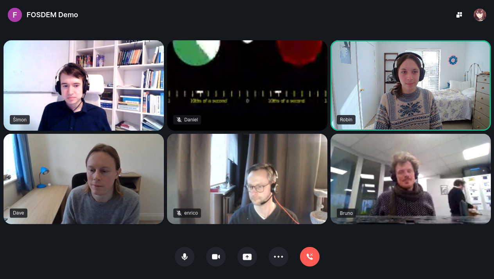

# Element Call

[](https://matrix.to/#/#webrtc:matrix.org)
[](https://translate.element.io/engage/element-call/)

Full mesh group calls powered by [Matrix](https://matrix.org), implementing [MatrixRTC](https://github.com/matrix-org/matrix-spec-proposals/blob/matthew/group-voip/proposals/3401-group-voip.md).



To try it out, visit our hosted version at [call.element.io](https://call.element.io). You can also find the latest development version continuously deployed to [element-call.netlify.app](https://element-call.netlify.app).

## Host it yourself

Until prebuilt tarballs are available, you'll need to build Element Call from source. First, clone and install the package:

```
git clone https://github.com/vector-im/element-call.git
cd element-call
yarn
yarn build
```

If all went well, you can now find the build output under `dist` as a series of static files. These can be hosted using any web server of your choice.

You may also wish to add a configuration file (Element Call uses the domain it's hosted on as a Homeserver URL by default,
but you can change this in the config file). This goes in `public/config.json` - you can use the sample as a starting point:

```
cp config/config.sample.json public/config.json
# edit public/config.json
```

Because Element Call uses client-side routing, your server must be able to route any requests to non-existing paths back to `/index.html`. For example, in Nginx you can achieve this with the `try_files` directive:

```
server {
    ...
    location / {
        ...
        try_files $uri /$uri /index.html;
    }
}
```

## Development

Element Call is built against [matrix-js-sdk](https://github.com/matrix-org/matrix-js-sdk/pull/2553). To get started, clone, install, and link the package:

```
git clone https://github.com/matrix-org/matrix-js-sdk.git
cd matrix-js-sdk
yarn
yarn link
```

Next, we can set up this project:

```
git clone https://github.com/vector-im/element-call.git
cd element-call
yarn
yarn link matrix-js-sdk
```

By default, the app expects you to have [Synapse](https://matrix-org.github.io/synapse/latest/setup/installation.html) installed locally and running on port 8008. If you wish to use another homeserver, you can add a config file as above.

You're now ready to launch the development server:

```
yarn dev
```

## Configuration

There are currently two different config files. `.env` holds variables that are used at build time, while `public/config.json` holds variables that are used at runtime. Documentation and default values for `public/config.json` can be found in [ConfigOptions.ts](src/config/ConfigOptions.ts).

## Translation

If you'd like to help translate Element Call, head over to [translate.element.io](https://translate.element.io/engage/element-call/). You're also encouraged to join the [Element Translators](https://matrix.to/#/#translators:element.io) space to discuss and coordinate translation efforts.
