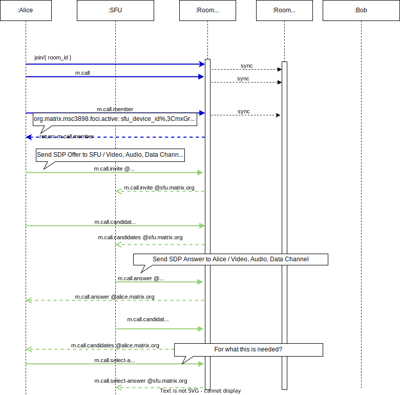

# Signaling

> A documentation of [MSC3898](https://github.com/matrix-org/matrix-spec-proposals/blob/1896fc7cdab7cbf5e653f84b650772e894e26485/proposals/3898-sfu.md) and  [MSC3401](https://github.com/matrix-org/matrix-spec-proposals/blob/6b98d667cf634f78c6604151276d5ef25d305aac/proposals/3401-group-voip.md)

With Signaling we mean the whole process of message exchange for the purpose of video audio media synchronization and connection.
WebRTC Signaling is a part of it. 

## Message Exchange
To set up and operate a video conference, data have to be exchanged between the participants.
Matrix itself provides tree different message protocols for data synchronization and data persistence.

1. [State Events](https://spec.matrix.org/latest/#events)

   State Events exchanged in the context of a room are stored in a directed acyclic graph (DAG) called an “event graph”.
2. TO-Device Messages

3. DCs (DataChannel Messages)

## Element Call Components

## Start a Group Call

## Join a Group Call

.. not yet finish

## Mute and Unmute

.. not yet finish

## Distributed Data States 

Because [Matrix is a distributed system](https://hacks.mozilla.org/2018/10/dweb-decentralised-real-time-interoperable-communication-with-matrix/), this leads us to distributed data states.

.. not yet
