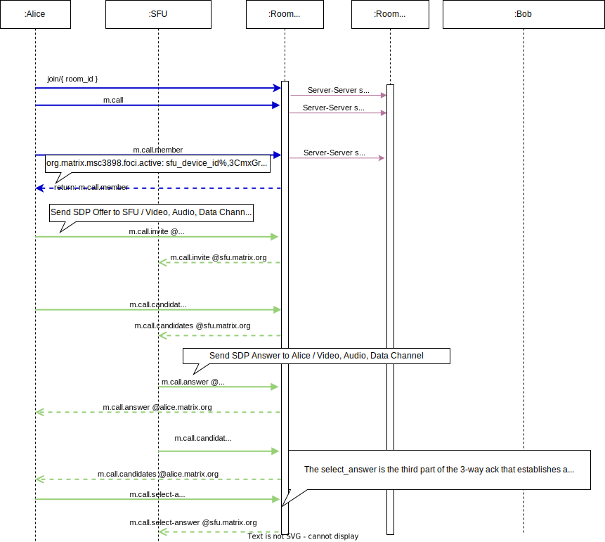
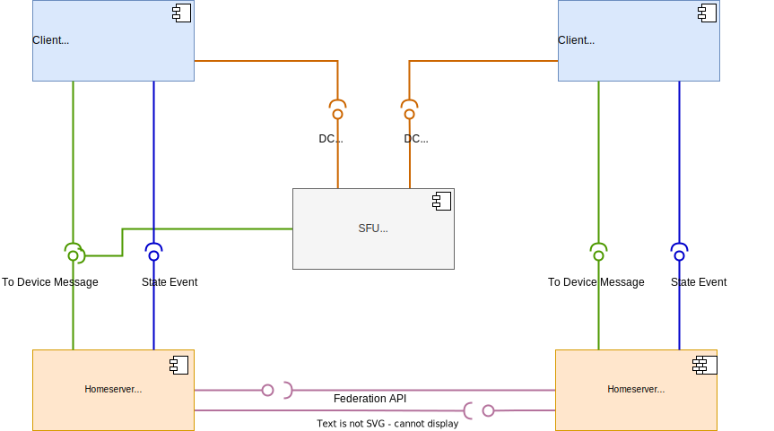
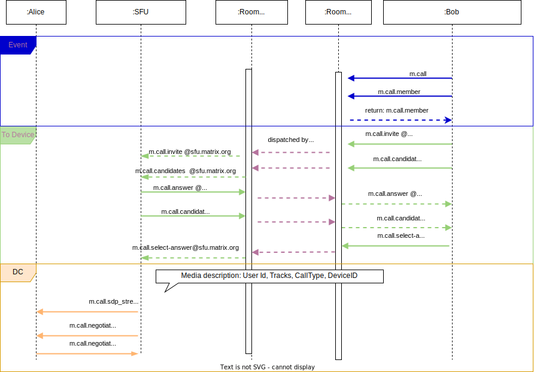
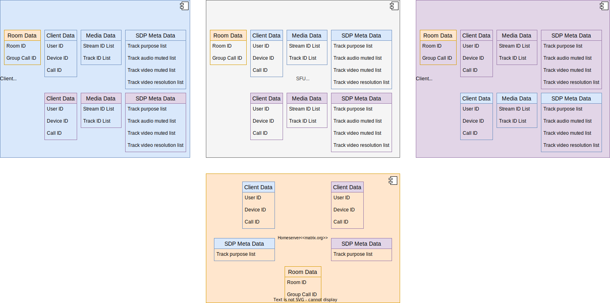

# Signaling

> A documentation
> of [MSC3898](https://github.com/matrix-org/matrix-spec-proposals/blob/1896fc7cdab7cbf5e653f84b650772e894e26485/proposals/3898-sfu.md)
> and [MSC3401](https://github.com/matrix-org/matrix-spec-proposals/blob/6b98d667cf634f78c6604151276d5ef25d305aac/proposals/3401-group-voip.md)

With Signaling we mean the whole process of message exchange for the purpose of video audio media synchronization and
connection.
WebRTC Signaling is a part of it.

## Message Exchange

To set up and operate a video conference, data have to be exchanged between the participants.
Matrix itself provides three different message protocols for data synchronization and data persistence.

1. [State Events](https://spec.matrix.org/latest/#events)

   State Events exchanged in the context of a room are stored in a directed acyclic graph (DAG) called an “event graph”.

2. TO-Device Messages

3. DCs (DataChannel Messages)

## Element Call Components


## Start a Group Call



## Join a Group Call

In case of joining a Group Call we get another situation.
Members which already joined the conference can use `DC Messages` (WebRTC datachannel messages).
The component diagram for user there already in a call looks more like this.



In Element Call the WebRTC media renegotiation is done via `DC Messages`.
In this case the sequence diagram for Users there joining a Group Call is more advanced.



## Mute, Unmute and ScreenShare

Mute of tracks and ScreenShare are characterized by the fact that they want to change media data in an existing WebRTC connection.
Additional information about media streams must be exchanged.
In Element Call this kind of information are saved in an Object called `SDPStreamMetadata`

[Matrix MSC3077](https://github.com/matrix-org/matrix-spec-proposals/blob/8c481845efa108f3965bc57b14e681d65b8754ae/proposals/3077-multi-stream-voip.md#proposal) introduced the `SDPStreamMetadata` object, in order to identify certain tracks and also to handle adapted information like `purpose` of a stream.
This object was extended again in [Matrix MSC3291](https://github.com/matrix-org/matrix-spec-proposals/blob/29e3c6d1a263ee628f989dac5a65289609670e65/proposals/3291-muting.md#example) with optional mute/unmute information about specific tracks.

```typescript
interface SDPStreamMetadata {
   [key: string]: SDPStreamMetadataObject;
}

interface SDPStreamMetadataObject {
    ...
    purpose: "m.usermedia" | "m.screenshare",
    audio_muted?: false,
    video_muted?: true,
}
```

### Exchange SDP Stream Meta Data via Events

This additional stream information are exchanged between the components via events.

#### SDP Stream Meta Data exchange via <i><u>to Device Messages</u></i>

The `SDPStreamMetadata` Object is added to the classic WebRTC Signaling Events.
This allows the exchange of custom metadata to be in sync with the creation and adaptation of the streaming pipelines.

- `m.call.invite`
- `m.call.answer`

#### SDP Stream Meta Data exchange via <i><u>DC Messages</u></i>

Participants in a conference are connected to each other via data channels. This makes it possible to exchange direct and fast messages.  
For usability reasons the fast exchange of `SDPStreamMetadata` is desired.
Element call has a separate DC Message to exchange additional stream information between participants of a call .

- `m.call.sdp_metadata_changed`
- `m.call.negotiate`

#### SDP Stream Meta Data exchange via <i><u>State Events</u></i>

In [MSC3401](https://github.com/matrix-org/matrix-spec-proposals/blob/6b98d667cf634f78c6604151276d5ef25d305aac/proposals/3401-group-voip.md#call-participation) did the metadata also find its way into the State Events.
The `purpose` of Media Stream is exchanged through this type of message:

- `m.call.member`

Through this, it becomes possible to access a parts of the `SDPStreamMetadata` in the global space.

#### Open Discussions

Embedding the SFU as another independent component makes it necessary to extend the object and the exchange of this Object (Please compare with [MSC3898](https://github.com/matrix-org/matrix-spec-proposals/blob/1896fc7cdab7cbf5e653f84b650772e894e26485/proposals/3898-sfu.md#sdp-stream-metadata-extension) )

- A new events: `m.call.track_subscription`
- A new structure:

```typescript
interface SDPStreamMetadataObject {
   ...
   "purpose": "m.usermedia" | "m.screenshare",
   "audio_muted:": false,
   "video_muted": true,
   "tracks": {
      "trackId1": {
         "width": 1920,
         "height": 1080
      },
      "trackId2": {}
   }
}
```

## Distributed Data States

Because [Matrix is a distributed system](https://hacks.mozilla.org/2018/10/dweb-decentralised-real-time-interoperable-communication-with-matrix/), this leads us to distributed data states.
Each Matrix Component can be a data source or data sink.
The constant exchange of data via event messages between the components lead to temporally inconsistent data states.
So it makes sense to take a closer look at where data is generated and where it is transported to.



## Links

- [MSC3898: Native Matrix VoIP signalling for cascaded SFUs](https://github.com/matrix-org/matrix-spec-proposals/blob/1896fc7cdab7cbf5e653f84b650772e894e26485/proposals/3898-sfu.md)
- [MSC3401: Native Group VoIP signalling](https://github.com/matrix-org/matrix-spec-proposals/blob/6b98d667cf634f78c6604151276d5ef25d305aac/proposals/3401-group-voip.md)
- [MSC3291: Muting in VoIP calls](https://github.com/matrix-org/matrix-spec-proposals/blob/29e3c6d1a263ee628f989dac5a65289609670e65/proposals/3291-muting.md)
- [MSC3077: Support for multi-stream VoIP](https://github.com/matrix-org/matrix-spec-proposals/blob/8c481845efa108f3965bc57b14e681d65b8754ae/proposals/3077-multi-stream-voip.md)
- [Decentralised real time interoperable communication with matrix](https://hacks.mozilla.org/2018/10/dweb-decentralised-real-time-interoperable-communication-with-matrix/)
- [Fosdem Native Group VoIP and Metaverse on Matrix by Robert Long, https://archive.fosdem.org](https://archive.fosdem.org/2022/schedule/event/matrix_metaverse/)
- [Events, https://spec.matrix.org/](https://spec.matrix.org/latest/#events)
- [Events, https://matrix.org/docs/spec](https://matrix.org/docs/spec/client_server/r0.4.0.html#events)
- [To Device Messages, https://spec.matrix.org](https://spec.matrix.org/latest/#devices)
- [To Device Messages, https://matrix.org/docs/spec](https://matrix.org/docs/spec/client_server/r0.4.0.html#send-to-device-messaging)
- [Federation API, https://spec.matrix.org](https://spec.matrix.org/v1.6/server-server-api/)
- [Client Server VoIp](https://spec.matrix.org/unstable/client-server-api/#voice-over-ip)
